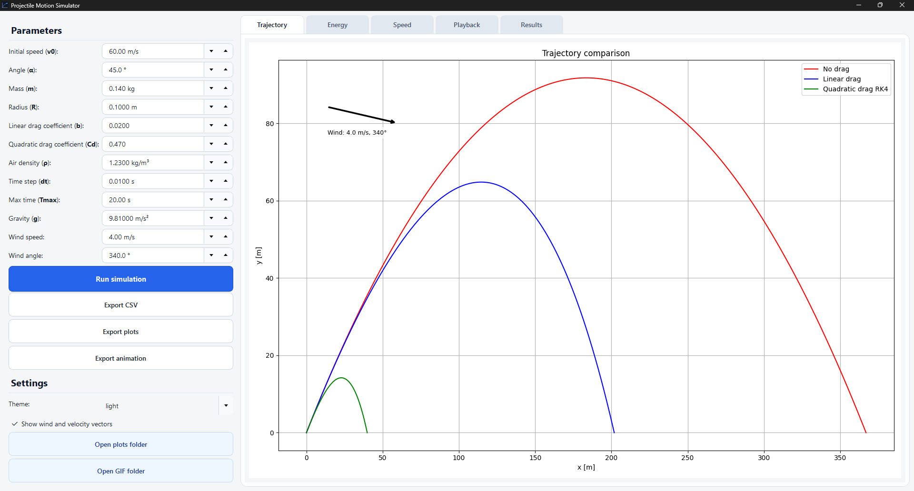
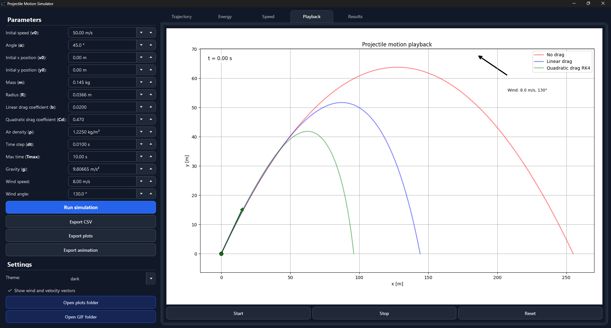
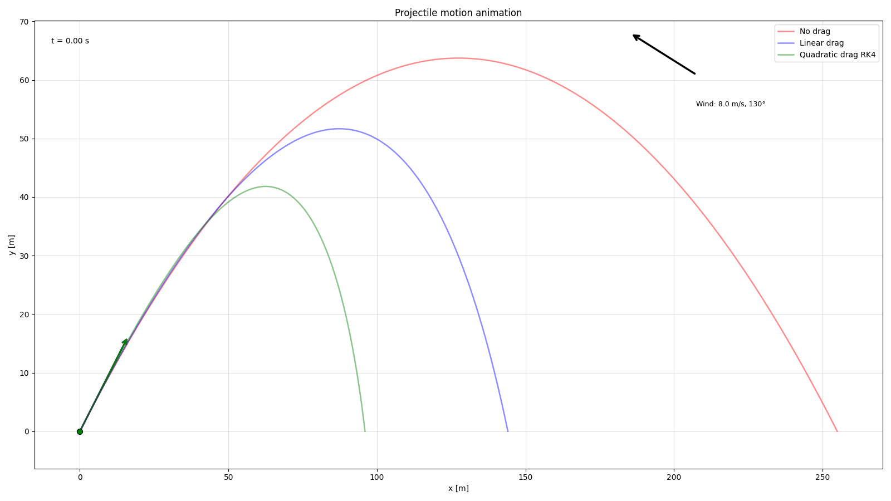

# To do

1. read and refactor the code
2. fix plots and gif exports so that elements don't overlap
3. update readme assets after fixing png and gif exporting
4. update readme after adding wind
5. fix code around wind logic
6. The playback animation can become less smooth for very small time steps or long simulations.
7. The current vector arrows show velocity, not total force or acceleration.
8. Quadratic drag uses a fixed time step; adaptive time stepping could improve accuracy.
9. Wind is constant in time and space; gusts or altitude-dependent wind are not modeled.
10. The projectile is treated as a point mass for motion, with radius used only for drag area.
11. Add info to the pdf and readme after adding all of the previous stuff.

# Projectile Motion Simulator

A desktop application for simulating and comparing projectile motion models.

This project was a learning experiment for me and a challenging step in understanding both GUI development (using **PySide6**) and physics simulation. The app allows the user to change physical parameters, run the simulation, visualize results, and export generated data, plots, and animation.

## Features

- Simulation of projectile motion with three models: no air resistance, linear drag, and quadratic drag using **Runge-Kutta numerical integration**.
- Interactive parameter panel with input validation for physically incorrect values.
- Validation is handled both in the GUI and in the parameter dataclass model, so invalid values cannot be used even if they are loaded from saved settings.
- Light and dark theme.
- Styled GUI using **Qt CSS**.
- Multiple result tabs: trajectory plot, energy plot, speed plot, playback animation, text results.
- Export options for: **CSV files**, plots, and GIF animation.
- Buttons for opening exported plots and animations directories.
- User settings and app settings are saved to **JSON files**.

## Preview

### Main window with light theme and trajectory plot



### Dark theme with animation panel



### Exported GIF animation



## Physics stuff

If you are interested in the physics part, take a look at the PDF file inside the `docs/` folder. It contains the equations and explanations of how the simulation works, based on my current understanding of the topic.

[Read the physics explanation PDF](docs/physics_projectile_motion.pdf)

## Project structure

- `config/` contains application parameters and settings logic.
- `gui/` contains the GUI code made with PySide6.
- `simulation/` contains the physics simulation logic.
- `storage/` contains helper functions for exporting CSV files.
- `visualization/` contains functions for exporting plots and animation.
- `style/` contains Qt CSS files and icons.
- `docs/` contains README images and the physics explanation PDF.
- `main.py` is the main file used to run the application.
- `requirements.txt` contains the libraries used in the project.

## Installation

### 1. Clone the repository

```bash
git clone "https://github.com/ShOOmet14/projectile_motion_of_a_sphere"
cd projectile_motion_of_a_sphere/
```

### 2. Create a virtual environment

#### Windows

```bash
python -m venv venv
```

#### macOS / Linux

```bash
python3 -m venv venv
```

### 3. Activate the virtual environment

#### Windows PowerShell

```powershell
venv\Scripts\Activate.ps1
```

#### Windows Command Prompt

```cmd
venv\Scripts\activate.bat
```

#### macOS / Linux

```bash
source venv/bin/activate
```

### 4. Install dependencies

#### Windows

```bash
pip install -r requirements.txt
```

#### macOS / Linux

```bash
pip3 install -r requirements.txt
```

### 5. Run the application

#### Windows

```bash
python main.py
```

#### macOS / Linux

```bash
python3 main.py
```

### 6. Deactivate the virtual environment

After closing the app, you can deactivate the virtual environment with:

```bash
deactivate
```
